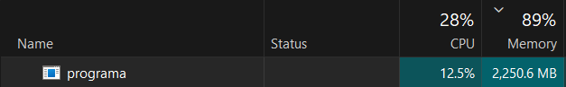
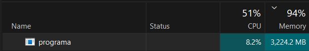

# Studentų Informacinė Sistema OOP_Marius_Augustinas
VU ISI Objektinio programavimo kurso laboratoriniai darbai

---

## Versijų istorija

| Versija | Pagrindiniai pakeitimai |
|---|---|
| **v0.1** | Pradinė realizacija — `std::vector`, rankinis įvedimas, vidurkio arba medianos skaičiavimas |
| **v0.2** | Failo skaitymas ir rašymas, rikiavimas, abu galutiniai balai skaičiuojami vienu metu |
| **v0.3** | Kodas suskaidytas į modulius (`*.h`/`*.cpp`), išimčių valdymas (`try`/`catch`) |
| **v0.4** | Studentų skirstymas į dvi grupes, spartos testavimas (1 ir 2 tyrimas), failų generatorius |
| **v1.0** | Programa pertvarkyta į `template<typename Container>` — vienas kodo kelias `vector`/`list`/`deque`, 3-ias tyrimas (konteinerių palyginimas). Trijų skirstymo strategijų realizacija ir spartos palyginimas, atminties analizė, `CMakeLists.txt` |

---

## v1.0 — Skirstymo strategijų palyginimas

### Techninė aplinka

| Parametras | Reikšmė |
|---|---|
| Procesorius | Intel Core i7-8565U (4 branduoliai / 8 gijų, iki 4.6 GHz) |
| RAM | 8 GB DDR4 |
| Saugykla | 250 GB SSD |
| OS | Windows 11 |
| Kompiliatorius | g++ (MinGW), `-std=c++17` |

---

### Strategijų aprašymas

**1 strategija** — `std::partition_copy` į **du naujus** konteinerius:
```cpp
std::partition_copy(studentai.begin(), studentai.end(),
    std::back_inserter(result.kietiakai),
    std::back_inserter(result.vargsiukai),
    [](const studentas &s) { return s.galutinisVid >= 5.0; });
```
Originalas nepakeičiamas. Studentai dublikuojami — tris konteinerius tuo pačiu metu. **Neefektyvu atminties atžvilgiu.**

**2 strategija** — `std::stable_partition` + `push_back` + `erase` **po vieną elementą**:
```cpp
auto it = std::stable_partition(studentai.begin(), studentai.end(), ...);
while (it != studentai.end()) {
    vargsiukai.push_back(std::move(*it));
    it = studentai.erase(it);   // O(n) kiekvienam elementui → O(n²) iš viso
}
```
Kiekvienam `erase` vektoriuje/deque reikia pastumti visus likusius elementus — **katastrofiškai lėta** su vector ir deque. Su list — O(1) vienam trynimui, todėl priimtina.

**3 strategija** — `std::stable_partition` + range konstruktorius + `erase` **bloku**:
```cpp
auto it = std::stable_partition(studentai.begin(), studentai.end(), ...);
Container vargsiukai(it, studentai.end());  // vienas kopijų perėjimas
studentai.erase(it, studentai.end());       // vienas trynimas
```
Geriausias variantas vector ir deque atveju — erase atliekamas vienu blokiniu žingsniu, ne n kartų.

---

### Atminties naudojimas (1 strategija, 10 000 000 studentų)

**1 strategija dublikuoja** duomenis: po rikiavimo naudojama ~X MB, po skirstymo — beveik 2× tiek, nes kietiakai ir vargsiukai yra originalaus sąrašo kopijos.


*1 pav. RAM naudojimas 10 000 000 studentų rikiavimo metu (1 strategija)*


*2 pav. RAM naudojimas po skirstymo į dvi grupes (1 strategija) — beveik dvigubai daugiau nei rikiavimo metu*

3 strategija šios problemos neturi: po `erase` originalas sutrumpinamas, bendras atminties pėdsakas ≈ pradinio dydžio.

---

### Skirstymo spartos palyginimas — tik skirstymo žingsnis (s)

#### vector

| Įrašų sk. | 1 strategija | 2 strategija | 3 strategija |
|---|---|---|---|
| 1 000 | 0.0006735 | 0.0257747 | **0.0004885** |
| 10 000 | 0.0067183 | 1.6450300  | **0.0053153** |
| 100 000 | **0.0666329** | 215.418  | 0.0666035 |
| 1 000 000 | 1.5456500 | sustabdyta  | **0.6458500** |
| 10 000 000 | 22.6479000 | sustabdyta  | **8.4700100** |

#### list

| Įrašų sk. | 1 strategija | 2 strategija | 3 strategija |
|---|---|---|---|
| 1 000 | **0.0005836** | 0.0007688 | 0.0007166 |
| 10 000 | **0.0054888** | 0.0059528 | 0.0079185 |
| 100 000 | **0.0635167** | 0.0783114 | 0.1009870 |
| 1 000 000 | **0.7844620** | sustabdyta | 1.0554100 |
| 10 000 000 | **12.5161000** | sustabdyta | 11.9878000 |

#### deque

| Įrašų sk. | 1 strategija | 2 strategija | 3 strategija |
|---|---|---|---|
| 1 000 | **0.0004293** | 0.0832196  | 0.0005133 |
| 10 000 | **0.0054114** | 1.8845500  | 0.0057501 |
| 100 000 | **0.0474443** | sustabdyta  | 0.0769321 |
| 1 000 000 | **0.5298810** | sustabdyta  | 0.7310760 |
| 10 000 000 | **9.4488500** | sustabdyta  | 9.5390000 |

---

### Kodėl 2 strategija žlugo su vector ir deque?

`std::vector` ir `std::deque` saugo elementus **nuosekliai atmintyje**. Ištrynus elementą iš vidurio, visi po jo esantys elementai turi būti pastumti — tai **O(n)** operacija. Kai triname n elementų po vieną, gauname **O(n²)** sudėtingumą:

| Įrašų sk. | 2 vs 3 strategija (vector) | Lėtesnė |
|---|---|---|
| 10 000 | 1.645 s vs 0.0053 s | **~309×** |
| 100 000 | 215 s vs 0.067 s | **~3 234×** |
| 1 000 000 | nebaigta (>1h) | — |

`std::list` neturi šios problemos — trynimas yra **O(1)**, nes tai dvikryptė sąsaja su rodyklėmis. Todėl 2 strategija su list veikia normaliai.

---

### Bendros išvados — strategijų palyginimas

| | 1 strategija | 2 strategija | 3 strategija |
|---|---|---|---|
| **Skirstymo sudėtingumas** | O(n) | O(n²) vector/deque; O(n) list | O(n) |
| **Atminties naudojimas** | 3× (originalas + 2 kopijos) | ~1.5× (originalas trumpėja) | ~1.5× (originalas trumpėja) |
| **Greičiausia skirstant (vector)** |  2–3× lėtesnė nei S3 dideliems | O(n²) | Taip |
| **Greičiausia skirstant (list)** | Taip | tik su list | šiek tiek lėtesnė |
| **Greičiausia skirstant (deque)** | Taip | O(n²) | ~lygi S1 |
| **Rekomenduojama** | Kai atmintis neribota | Tik su list | **Geriausias bendras variantas** |

**3 strategija yra geriausias pasirinkimas** — ji veikia efektyviai su visais trimis konteineriais ir neeikvoja papildomos atminties.

---

## 3 tyrimas — konteinerių palyginimas (1 strategija, `partition_copy`)

> Matuojami: nuskaitymas, rikiavimas, skirstymas. Failo rašymas į matavimą neįtraukiamas.

### Nuskaitymas (s)

| Įrašų sk. | vector | list | deque |
|---|---|---|---|
| 1 000 | 0.0196454 | **0.0048164** | 0.0048821 |
| 10 000 | 0.0529795 | **0.0423272** | 0.0434205 |
| 100 000 | 0.4344053 | 0.3874983 | **0.3778310** |
| 1 000 000 | **4.0397767** | 4.7046400 | 4.7422933 |
| 10 000 000 | 54.9860333 | 58.3275667 | **54.8904333** |

### Rikiavimas (s)

| Įrašų sk. | vector | list | deque |
|---|---|---|---|
| 1 000 | 0.0021201 | **0.0008624** | 0.0024529 |
| 10 000 | 0.0336593 | **0.0061455** | 0.0412758 |
| 100 000 | 0.349848 | **0.0646853** | 0.378782 |
| 1 000 000 | 9.50295 | **1.43094** | 6.5229 |
| 10 000 000 | 73.956 | **16.4002** | 79.0366 |

`std::list` rikiavimas su 10M studentų yra **~4.5× greitesnis** nei vector ir **~4.8×** greitesnis nei deque. `list::sort()` naudoja merge sort, kuris tik perrikiuoja rodykles — nekopijuoja `studentas` objektų (su `vector<int> namuDarbai` viduje tai labai brangu).

### Skirstymas (s) — 1 strategija

| Įrašų sk. | vector | list | deque |
|---|---|---|---|
| 1 000 | 0.0006735 | 0.0005836 | **0.0004293** |
| 10 000 | 0.0067183 | 0.0054888 | **0.0054114** |
| 100 000 | 0.0666329 | 0.0635167 | **0.0474443** |
| 1 000 000 | 1.54565 | 0.784462 | **0.529881** |
| 10 000 000 | 22.6479 | 12.5161 | **9.44885** |

---

## Failų struktūra

```
.
├── CMakeLists.txt
├── LICENSE
├── README.md
├── data/
│   ├── studentai1000.txt
│   ├── studentai10000.txt
│   ├── studentai100000.txt
│   ├── studentai1000000.txt
│   └── studentai10000000.txt
├── main.h          # Struktūros, konstantos, ne-šablonų deklaracijos
├── main.cpp        # main() + runProgram<Container>() šablonas
├── menu.h / menu.cpp
├── enter.h / enter.cpp
├── generate.h / generate.cpp
├── file.h          # readStudentaiFromFile<T>, writeStudentaiListToFile<T> šablonai
├── file.cpp
├── calculate.h     # calculateGalutinis<T>, sortStudentai<T>, splitStudentai<T>, partitionStudentai<T>
├── calculate.cpp
├── output.h
├── print.h / print.cpp
└── test.h / test.cpp
```

---

## Naudojimosi instrukcija

### Paleidimas

```bash
.\programa.exe          # Windows
```

### Pirmas ekranas — konteinerio pasirinkimas

```
Pasirinkite konteinerį:
1. vector
2. list
3. deque
```

Pasirinkimas galioja visai sesijai. Norėdami pakeisti — paleiskite programą iš naujo.

### Meniu pasirinkimai

| Nr. | Veiksmas |
|---|---|
| 1 | Įvesti studentus ranka |
| 2 | Generuoti tik pažymius (vardai įvedami rankiniu būdu) |
| 3 | Generuoti studentus automatiškai |
| 4 | Nuskaityti iš failo (turi būti `data/` aplanke arba pilnas kelias) |
| 5 | Generuoti testinį studentų failą |
| 6 | Spartos testas — failų kūrimas (1 tyrimas) |
| 7 | Spartos testas — duomenų apdorojimas (2 tyrimas) |
| 8 | Spartos testas — konteinerių palyginimas (3 tyrimas) |
| 0 | Baigti |

### Failo formatas

Programa skaito `.txt` failus šiuo formatu:
```
Vardas                   Pavardė                       ND1       ND2  ...  Egzaminas
VardasNR1                PavardeNR1                      7         3  ...          5
```
Antraštė naudojama automatiškai nustatyti namų darbų stulpelių skaičių.

---

## Įdiegimo instrukcija

### Reikalavimai
- C++17 palaikantis kompiliatorius (g++ 7+, clang++ 5+, MSVC 2017+)
- CMake 3.16+

### CMake (rekomenduojama, visos OS)

```bash
mkdir build
cd build

cmake .. -G "MinGW Makefiles"
cmake --build .
.\programa.exe  # Windows
```

### g++ tiesiogiai

```bash
g++ -std=c++17 -Wall -O2 main.cpp menu.cpp enter.cpp generate.cpp file.cpp calculate.cpp print.cpp test.cpp -o programa.exe
```

---
