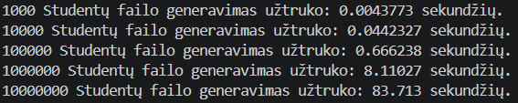
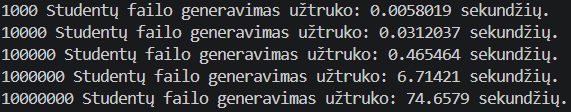
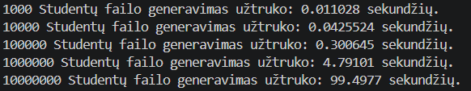
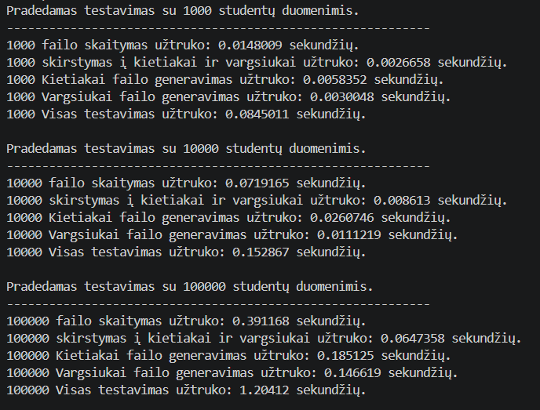
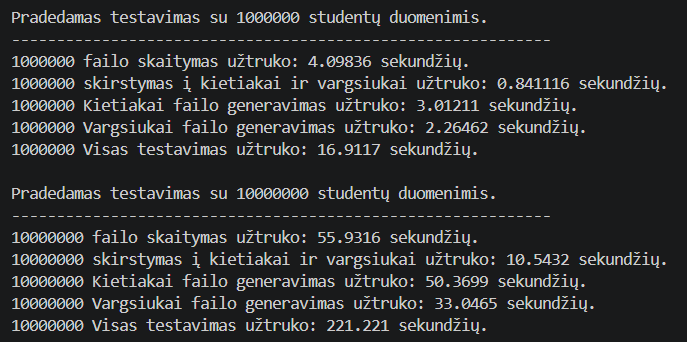
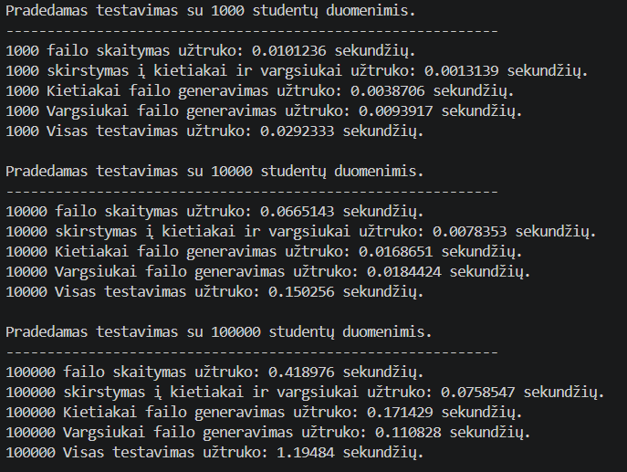
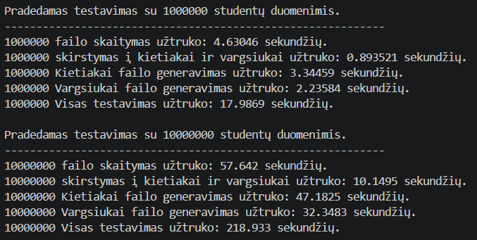
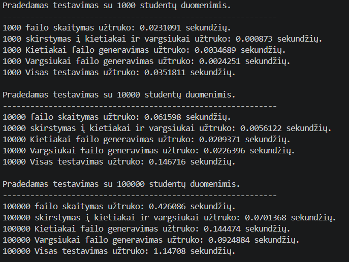
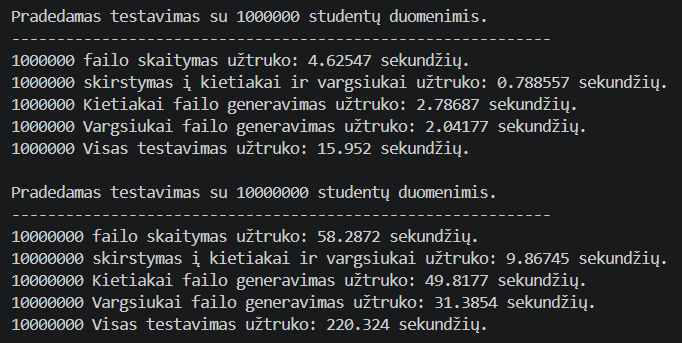
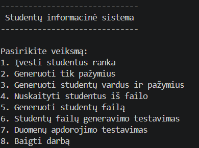

# Studentų Informacinė Sistema OOP_Marius_Augustinas
VU ISI Objektinio programavimo kurso laboratoriniai darbai

v0.4 — C++ programa, skirta studentų informacijos įvedimui, saugojimui, galutinio pažymio skaičiavimui, rikiavimui, skirstymui į kategorijas ir įrašymui į failus. Versijoje v0.4 pridėtas studentų skirstymas į dvi grupes pagal galutinį balą, atskiras failų generavimo įrankis, bei dviejų nepriklausomų testavimo funkcijų spartos analizė su išmatuotais rezultatais.

---

## Testavimo rezultatai

### 1 tyrimas — failų kūrimas (`testGenerateStudentai`)

> Matuojama tik failo rašymo trukmė, be duomenų generavimo. Nenaudojami anksčiau sukurti failai.

| Įrašų skaičius | Failo kūrimo vidurkis (s) |
|---|---|
| 1 000 | 0.0070691 |
| 10 000 | 0.0393296 |
| 100 000 | 0.4774490 |
| 1 000 000 | 6.5384967 |
| 10 000 000 | 85.9562000 |


*1 pav. 1 Tyrimo rezultatai*


*2 pav. 1 Tyrimo rezultatai*


*3 pav. 1 Tyrimo rezultatai*

---

### 2 tyrimas — duomenų apdorojimas (`testData`)

> Naudojami anksčiau sugeneruoti failai. Matuojami atskiri žingsniai ir bendra trukmė.

| Įrašų skaičius | Nuskaitymas (s) | Skirstymas (s) | Kietiakai rašymas (s) | Vargsiukai rašymas (s) | Visa programa (s) |
|---|---|---|---|---|---|
| 1 000 | 0.0160112 | 0.0016176 | 0.0043916 | 0.0049405 | 0.0496385 |
| 10 000 | 0.0666763 | 0.0073535 | 0.0212923 | 0.0174013 | 0.1499477 |
| 100 000 | 0.4120767 | 0.0702424 | 0.1670093 | 0.1166451 | 1.1820133 |
| 1 000 000 | 4.4514300 | 0.8410647 | 3.0478567 | 2.1807433 | 16.9502000 |
| 10 000 000 | 57.2869333 | 10.1867167 | 49.1233667 | 32.2600667 | 220.1593333 |


*1 pav. 2 Tyrimo rezultatai*


*1 pav. 2 Tyrimo rezultatai*


*1 pav. 2 Tyrimo rezultatai*


*1 pav. 2 Tyrimo rezultatai*


*1 pav. 2 Tyrimo rezultatai*


*1 pav. 2 Tyrimo rezultatai*

---

## Failų struktūra

```
.
├── LICENSE
├── README.md
├── data/                       # Sugeneruoti testiniai failai (archyvas)
│   ├── studentai1000.txt
│   ├── studentai10000.txt
│   ├── studentai100000.txt
│   ├── studentai1000000.txt
│   └── studentai10000000.txt
├── main.h            # Bendra antraštė: struktūros, konstantos, funkcijų deklaracijos
├── mainVector.cpp    # Pagrindinis programos failas
├── menu.h / menu.cpp           # Meniu ir pasirinkimų funkcijos
├── enter.h / enter.cpp         # Rankinio įvedimo funkcijos
├── generate.h / generate.cpp   # Studentų ir pažymių generavimo funkcijos
├── file.h / file.cpp           # Failo skaitymo ir rašymo funkcijos
├── calculate.h / calculate.cpp # Skaičiavimo, rikiavimo ir skirstymo funkcijos
├── output.h / output.cpp       # Išvesties nukreipimo funkcija
├── print.h / print.cpp         # Spausdinimo į konsolę funkcijos
└── test.h / test.cpp           # Spartos testavimo funkcijos
```

---

## Duomenų struktūros

### `studentas`
Saugo vieno studento informaciją:
- `vardas` — studento vardas
- `pavarde` — studento pavardė
- `namuDarbai` — namų darbų pažymių sąrašas (`vector<int>`)
- `egzaminas` — egzamino pažymys (`minPazymys`–`maxPazymys`)
- `galutinisVid` — galutinis pažymys, skaičiuotas pagal vidurkį
- `galutinisMed` — galutinis pažymys, skaičiuotas pagal medianą

### `splitResult` *(nauja v0.4)*
Saugo studentų skirstymo į dvi grupes rezultatą:
- `kietiakai` — studentai, kurių `galutinisMed >= 5.0`
- `vargsiukai` — studentai, kurių `galutinisMed < 5.0`

### Konstantos (`main.h`)
- `NUMBER_OF_PAZYMYS` (15) — fiksuotas namų darbų skaičius generavimo ir failo rašymo funkcijose
- `minPazymys` (1) ir `maxPazymys` (10) — pažymių ribos
- `namuDarbaiSvertis` (0.4) ir `egzaminasSvertis` (0.6) — galutinio pažymio svoriai

---

## Programos veikimas

### 1. Paleidimas
Programa pradedama `main()` funkcijoje (`mainVector.cpp`):
- Nustatomas konsolės kodavimas į UTF-8 (`SetConsoleOutputCP`, `SetConsoleCP`)
- Išvedamas sveikinimo pranešimas
- Vartotojui pateikiamas meniu cikle (`while(menuLoop)`) — programa nesibaigia po vieno veiksmo, kol nepasirenkama `8`
- Visas veiksmų blokas apgaubtas `try`/`catch(const std::exception&)` bloku


*4 pav. Programos paleidimo ir meniu vaizdas*

### 2. Meniu pasirinkimai — `askMenuChoice()`
- `1` — Įvesti studentus ranka
- `2` — Generuoti tik pažymius (vardai įvedami rankiniu būdu)
- `3` — Generuoti studentų vardus ir pažymius automatiškai
- `4` — Nuskaityti studentus iš failo
- `5` — Generuoti studentų failą (tik failo sukūrimui, be apdorojimo)
- `6` — Failų generavimo spartos testavimas (1 tyrimas)
- `7` — Duomenų apdorojimo spartos testavimas (2 tyrimas)
- `8` — Baigti darbą

### 3. Studentų įvedimas — `enter.cpp`
- `enterStudentaiVector()` — kaupia studentus į vektorių, po kiekvieno klausia `y/n`
- `enterStudentas(n)` — įveda vieno studento duomenis:
  - `enterName(n)` / `enterSurname(n)` — tik raidės (`isAllLetters`)
  - `enterNumberOfPazymys(n)` — namų darbų skaičius (≥ 0)
  - `enterPazymiai(n, m)` — pažymiai (`minPazymys`–`maxPazymys`)
  - `enterEgzaminas(n)` — egzamino pažymys (`minPazymys`–`maxPazymys`)

### 4. Studentų ir failų generavimas — `generate.cpp`

- `generateStudentai(n)` — generuoja `n` studentų su šabloniniais vardais ir atsitiktiniais pažymiais:
  - Vardai formuojami kaip `VardasNR1 PavardeNR1`, `VardasNR2 PavardeNR2` ir t.t.
  - Kiekvienas studentas turi lygiai `NUMBER_OF_PAZYMYS` (15) namų darbų pažymių
  - Prieš ciklą kviečiamas `studentai.reserve(n)` — išvengiama perteklinių atminties perskirstymų
  - Naudojamas vienas bendras `std::mt19937` generatorius (`getRng()`)

- `generateOnlyPazymiai(n)` — vardai ir pavardės įvedami rankiniu būdu, pažymiai generuojami

### 5. Failų skaitymas ir rašymas — `file.cpp`

**Skaitymas:**
- `enterFileName()` — tikrina `.txt` plėtinį
- `readStudentaiFromFile(filename)` — nuskaito studentus iš `.txt` failo:
  - Iš antraštės eilutės automatiškai nustato namų darbų stulpelių skaičių pagal `ND` žymėjimą
  - Tikrina kiekvieną eilutę ir pažymių ribas — klaidos atveju meta `std::runtime_error`

**Rašymas (du formatai):**
- `writeStudentaiToFile(studentai, filename)` — išvesties formatas su galutiniais balais (Vid. ir Med.)
- `writeStudentaiListToFile(studentai, filename)` — generavimo formatas su visais namų darbų pažymiais ir egzaminu; suderinamas su `readStudentaiFromFile` skaitymui

Sugeneruoto failo formato pavyzdys:
```
Vardas                   Pavardė                       ND1       ND2  ...  Egzaminas
VardasNR1                PavardeNR1                      7         3  ...          5
VardasNR2                PavardeNR2                      9         1  ...          8
```

### 6. Galutinio pažymio skaičiavimas — `calculate.cpp`
```
galutinis = 0.4 × namų_darbų_vidurkis_arba_mediana + 0.6 × egzamino_pažymys
```
- `calculateGalutinisAverage()` → `galutinisVid`
- `calculateGalutinisMedian()` → `galutinisMed`
- `calculateGalutinisVector()` — taiko abu visiems studentams; jei sąrašas tuščias, meta `std::runtime_error`

### 7. Rikiavimas — `sortStudentai()`
- `1` — pagal vardą (abėcėliškai)
- `2` — pagal pavardę (abėcėliškai)
- `3` — pagal galutinį (vidurkis, mažėjančia tvarka)
- `4` — pagal galutinį (mediana, mažėjančia tvarka)

### 8. Studentų skirstymas į kategorijas — `splitStudentai()` *(nauja v0.4)*

Naudojamas `std::partition_copy` — vienas perėjimas per vektorių, originalas nekeičiamas:

```
galutinisMed >= 5.0  →  result.kietiakai
galutinisMed  < 5.0  →  result.vargsiukai
```

Grąžinamas `splitResult` — struktūra su dviem vektoriais. Rezultatai išvedami į du atskirus failus arba konsolę (`outputStudentai` kviečiamas du kartus — atskirai kietiakiams ir vargsiukams).

### 9. Rezultatų išvedimas — `output.cpp`
- `1` — spausdinama į konsolę (`printStudentaiVector`)
- `2` — rašoma į failą (klausiamas failo pavadinimas, kviečiama `writeStudentaiToFile`)

### 10. Spartos testavimas — `test.cpp` *(nauja v0.4)*

**1 tyrimas — `testGenerateStudentai(n)`:**
- Sugeneruoja `n` studentų į vektorių (`generateStudentai`)
- Matuoja **tik** `writeStudentaiListToFile` trukmę — failo sukūrimą ir uždarymą
- Po rašymo vektorius išvalomas (`studentai.clear()`)
- Kviečiama meniu pasirinkimu `6` penkis kartus iš eilės (1 000 → 10 000 000)

**2 tyrimas — `testData(n)`:**
- Atidaro anksčiau sugeneruotą failą `data/studentaiN.txt`
- Atskirai matuoja kiekvieną žingsnį:
  1. Failo nuskaitymas (`readStudentaiFromFile`)
  2. Galutinių balų skaičiavimas ir rikiavimas pagal medianą
  3. Skirstymas į dvi grupes (`splitStudentai`)
  4. Kietiakai rašymas į `testkietiakaiN.txt`
  5. Vargsiukai rašymas į `testvargsiukaiN.txt`
- Matuoja bendrą veikimo laiką nuo pradžios iki pabaigos
- Kviečiama meniu pasirinkimu `7` penkis kartus iš eilės (1 000 → 10 000 000)

---

## Klaidų / išimčių valdymas

| Vieta | Sąlyga | Pranešimas |
|---|---|---|
| `readStudentaiFromFile` | Failas neegzistuoja / nepavyko atidaryti | „Nepavyko atidaryti failo: ..." |
| `readStudentaiFromFile` | Failas tuščias / be antraštės | „Failas tuščias arba sugadintas: ..." |
| `readStudentaiFromFile` | Trūksta vardo/pavardės/pažymio eilutėje | „Eilutėje N trūksta ..." |
| `readStudentaiFromFile` | Pažymys už `minPazymys`–`maxPazymys` ribų | „Eilutėje N pažymys už ribų (1-10): ..." |
| `writeStudentaiToFile` | Nepavyko sukurti išvesties failo | „Nepavyko sukurti failo: ..." |
| `writeStudentaiListToFile` | Nepavyko sukurti išvesties failo | „Nepavyko sukurti failo: ..." |
| `calculateGalutinisVector` | Tuščias studentų sąrašas | „Studentų sąrašas tuščias — nėra ką skaičiuoti." |
| `printStudentaiVector` | Tuščias studentų sąrašas | „Studentų sąrašas tuščias — nėra ko spausdinti." |
| `outputStudentai` | Neteisingas išvesties formato pasirinkimas | „Neteisingas pasirinkimas išvesties formatui." |

---

## Įvesties validacija

- Vardas / pavardė turi ne raides → `isAllLetters`, kartojama įvestis
- Pažymys ne tarp `minPazymys` ir `maxPazymys` → kartojama įvestis arba `std::runtime_error` (iš failo)
- Namų darbų skaičius neigiamas → kartojama įvestis
- Failo pavadinimas be `.txt` plėtinio → kartojama įvestis
- Meniu pasirinkimas už ribų → kartojama įvestis

---

## Kompiliavimas

```bash
g++ -std=c++17 mainVector.cpp menu.cpp enter.cpp generate.cpp file.cpp calculate.cpp output.cpp print.cpp test.cpp -o programa
./programa
```

> **Pastaba:** programa naudoja `<windows.h>`, todėl skirta Windows operacinei sistemai.

---

## Pakeitimai nuo v0.3 → v0.4

- Pridėtas `splitStudentai()` — naudoja `std::partition_copy` studentams skirstyti į `kietiakai` (≥ 5.0) ir `vargsiukai` (< 5.0) pagal `galutinisMed`; grąžina `struct splitResult`
- Pridėtas `struct splitResult` su dviem vektoriais (`main.h`)
- Meniu išplėstas iki 8 pasirinkimų: pridėti `5` (generuoti failą), `6` (1 tyrimas), `7` (2 tyrimas)
- Pridėtas `test.h`/`test.cpp` su dviem testavimo funkcijomis: `testGenerateStudentai(n)` ir `testData(n)`
- `testData(n)` matuoja 4 atskirus žingsnius ir bendrą trukmę, naudoja failus iš `data/` aplanko
- `generateStudentai(n)` — šabloniniai vardai `VardasNRi`/`PavardeNRi`, fiksuotas `NUMBER_OF_PAZYMYS` namų darbų skaičius, `studentai.reserve(n)` prieš ciklą
- `writeStudentaiListToFile()` — pilno įrašų formato rašymas, suderinamas su `readStudentaiFromFile()` skaitymui
- Pagrindinis ciklas `main()` pakeistas iš vienkartinio `switch` į `while(menuLoop)` — programa leidžia atlikti kelis veiksmus be paleidimo iš naujo
- Po kiekvieno scenarijaus `splitStudentai()` ir `outputStudentai()` kviečiamas du kartus — atskirai kietiakiams ir vargsiukams
