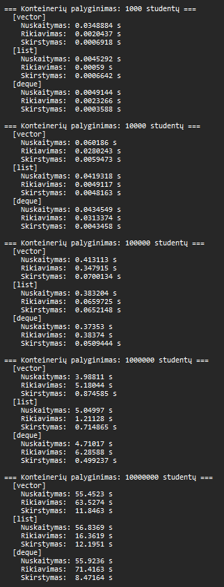
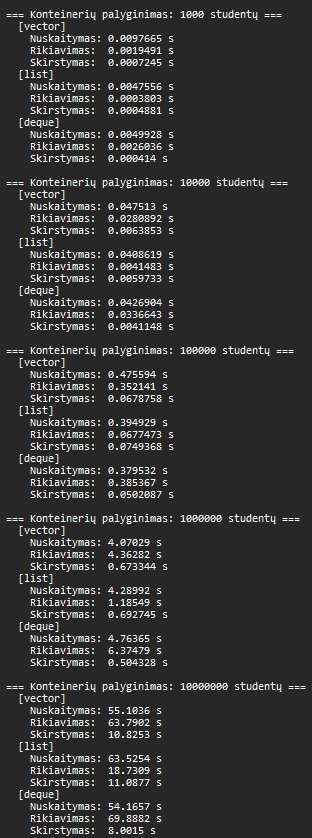
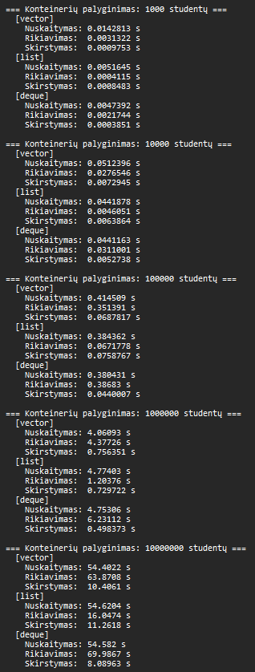

# Studentų Informacinė Sistema OOP_Marius_Augustinas
VU ISI Objektinio programavimo kurso laboratoriniai darbai

v1.0 — C++ programa su pilnu šablonų (templates) palaikymu visiems konteineriams. Versijoje v1.0 programa pertvarkyta naudojant C++ šablonus (`template<typename Container>`), leidžiančius paleisti visą programos logiką su `std::vector`, `std::list` arba `std::deque` — pasirenkama vieną kartą paleidžiant programą. Pridėtas 3-ias tyrimas, lyginantis konteinerių spartą nuskaitymo, rikiavimo ir skirstymo žingsniuose.

---

## Techninė aplinka

| Parametras | Reikšmė |
|---|---|
| Procesorius | Intel Core i7-8565U (4 branduoliai / 8 gijų, iki 4.6 GHz) |
| RAM | 8 GB DDR4 |
| Saugykla | 250 GB SSD |
| OS | Windows 11 |
| Kompiliatorius | g++ (MinGW), `-std=c++17` |

---

## 3 tyrimas — konteinerių palyginimas (`testContainers`)

> Visi trys konteineriai testuojami su **tais pačiais failais** tyrimo patikimumui.
> Matuojami tik trys žingsniai: nuskaitymas į konteinerį, rikiavimas, skirstymas į dvi grupes.
> Failo rašymas ir galutinių balų skaičiavimas į matavimą **neįtraukiamas**.

### Metodika

- Rikiavimas: `std::vector` ir `std::deque` — `std::sort` (reikalauja random-access iteratorių); `std::list` — narys `.sort()` (merge sort, neturi random-access iteratorių)
- Skirstymas: `std::partition_copy` — veikia su visais trimis konteineriais (forward iteratoriai)
- Kiekvienas dydis testuotas **3 kartus**, lentelėse pateikiami **vidurkiai**

---

### 1 bandymas


*1 pav. 3 tyrimo 1 bandymo konsolės išvestis*

### 2 bandymas


*2 pav. 3 tyrimo 2 bandymo konsolės išvestis*

### 3 bandymas


*3 pav. 3 tyrimo 3 bandymo konsolės išvestis*

---

### Nuskaitymas iš failo (s)

| Įrašų sk. | vector | list | deque |
|---|---|---|---|
| 1 000 | 0.0196454 | **0.0048164** | 0.0048821 |
| 10 000 | 0.0529795 | **0.0423272** | 0.0434205 |
| 100 000 | 0.4344053 | 0.3874983 | **0.3778310** |
| 1 000 000 | **4.0397767** | 4.7046400 | 4.7422933 |
| 10 000 000 | 54.9860333 | 58.3275667 | **54.8904333** |

### Rikiavimas (s)

| Įrašų sk. | vector | list | deque |
|---|---|---|---|
| 1 000 | 0.0023750 | **0.0004606** | 0.0023682 |
| 10 000 | 0.0279227 | **0.0045550** | 0.0320339 |
| 100 000 | 0.3504823 | **0.0669659** | 0.3853123 |
| 1 000 000 | 4.6401733 | **1.2001767** | 6.2972633 |
| 10 000 000 | 63.7294667 | **17.0467333** | 70.4304000 |

### Skirstymas į dvi grupes (s)

| Įrašų sk. | vector | list | deque |
|---|---|---|---|
| 1 000 | 0.0007972 | 0.0006669 | **0.0003860** |
| 10 000 | 0.0065424 | 0.0057253 | **0.0045781** |
| 100 000 | 0.0688903 | 0.0720094 | **0.0483846** |
| 1 000 000 | 0.7680933 | 0.7124440 | **0.5006460** |
| 10 000 000 | 11.0259000 | 11.5148667 | **8.1875900** |

---

### Apibendrinimas

| Žingsnis | Greičiausias | Lėčiausias | Pastaba |
|---|---|---|---|
| Nuskaitymas | `deque` / `vector` | `list` (dideliems) | Skirtumas nedidelis |
| Rikiavimas | **`list`** | `deque` | list iki ~4x greitesnis už vector, iki ~5x už deque |
| Skirstymas | **`deque`** | `vector` | Skirtumas mažas |

**Rikiavimo rezultatas** yra svarbiausias ir labiausiai išsiskiriantis: `std::list` naudoja merge sort, kuris neperkeldinėja elementų atmintyje — su 10M studentų `list` rikiavimas (~17 s) yra **beveik 4x greitesnis** nei `vector` (~64 s) ir **4x greitesnis** nei `deque` (~70 s). Tai atspindi fundamentalų skirtumą: `std::sort` su `vector`/`deque` reikalauja elementų perkėlimo (o kiekvienas `studentas` turi `vector<int> namuDarbai` viduje — tai brangi operacija), tuo tarpu `list::sort` tik perrikiuoja rodykles (pointers).

**Nuskaitymo rezultatas**: `vector` su mažais dydžiais lėtesnis dėl pirmojo `push_back` į tuščią vektorių ir galimų perskirstymų (nėra `reserve`); su 1M+ `vector` tampa greičiausias dėl geresnio cache lokalumo.

**Skirstymo rezultatas**: `deque` nuosekliai greičiausias — `std::partition_copy` su `back_inserter` į `deque` yra efektyvesnis nei į `vector` (mažiau perskirstymų) ir į `list` (geriau cache).

---

## Failų struktūra

```
.
├── LICENSE
├── README.md
├── data/
│   ├── studentai1000.txt
│   ├── studentai10000.txt
│   ├── studentai100000.txt
│   ├── studentai1000000.txt
│   └── studentai10000000.txt
├── main.h          # Struktūros, konstantos, ne-šablonų deklaracijos
├── main.cpp        # main() + runProgram<Container>() šablonas
├── menu.h / menu.cpp
├── enter.h / enter.cpp
├── generate.h / generate.cpp
├── file.h          # readStudentaiFromFile<T>, writeStudentaiListToFile<T> šablonai
├── file.cpp        # enterFileName, enterOutputFileName
├── calculate.h     # calculateGalutinis<T>, sortStudentai<T>, splitStudentai<T> šablonai
├── calculate.cpp   # calculateGalutinisAverage, calculateGalutinisMedian
├── output.h        # outputStudentai<T> šablonas
├── print.h         # printStudentai<T> šablonas
├── print.cpp       # printWelcome
└── test.h / test.cpp
```

---

## Pakeitimai nuo v0.4 → v1.0

- Visa programa pertvarkyta į `runProgram<Container>()` šabloną — vienas kodo kelias veikia su `vector`, `list` ir `deque`
- Pridėtas `askContainerChoice()` — vartotojas renkasi konteinerį prieš meniu
- `splitResult<Container>` — šablonų struktūra vietoj trijų atskirų struktūrų
- Visos failo rašymo, skaitymo, spausdinimo, generavimo, rikiavimo ir skirstymo funkcijos pervertos į šablonus
- `sortStudentai<Container>` naudoja `if constexpr` — automatiškai pasirenka `list.sort()` arba `std::sort`
- Pridėtas 3-ias tyrimas `testContainers(n)` — lygina visus tris konteinerius tuo pačiu failu

## Kompiliavimas

```bash
g++ -std=c++17 -Wall main.cpp menu.cpp enter.cpp generate.cpp file.cpp calculate.cpp print.cpp test.cpp -o programa.exe
./programa.exe
```
